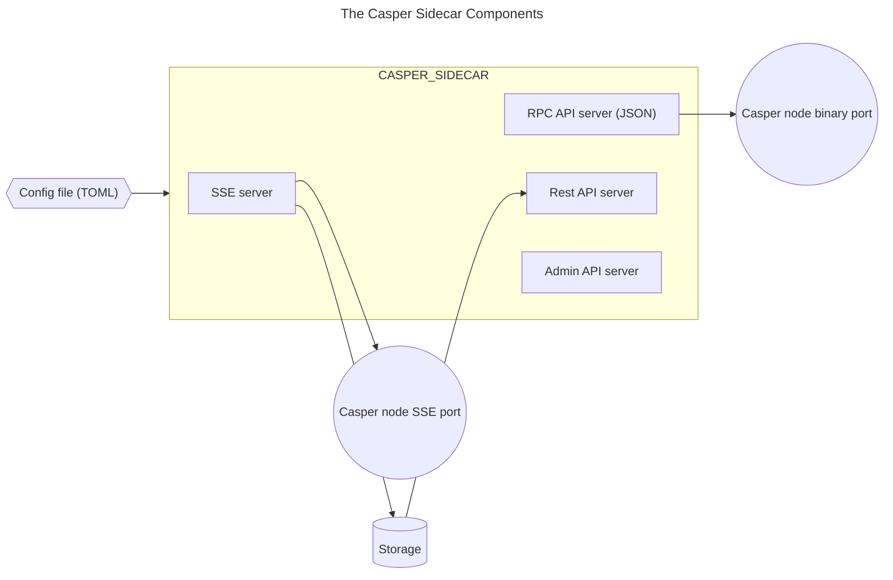
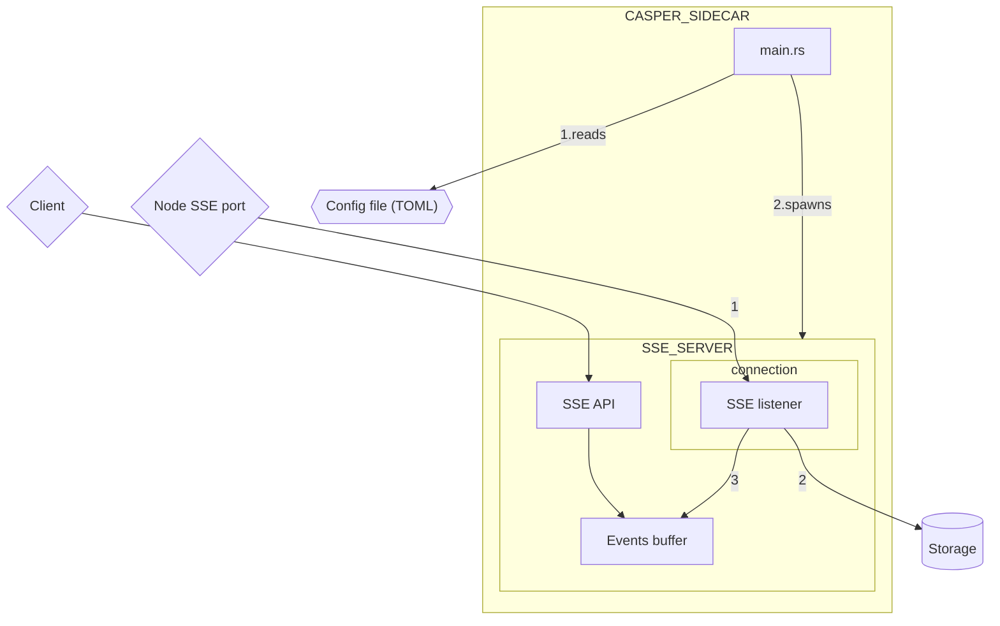
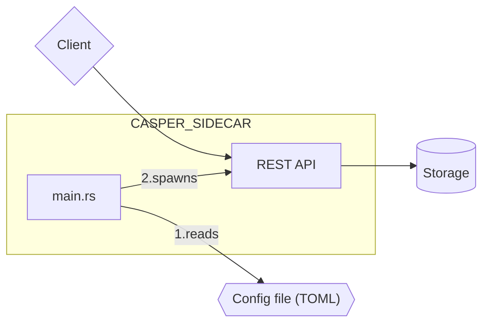
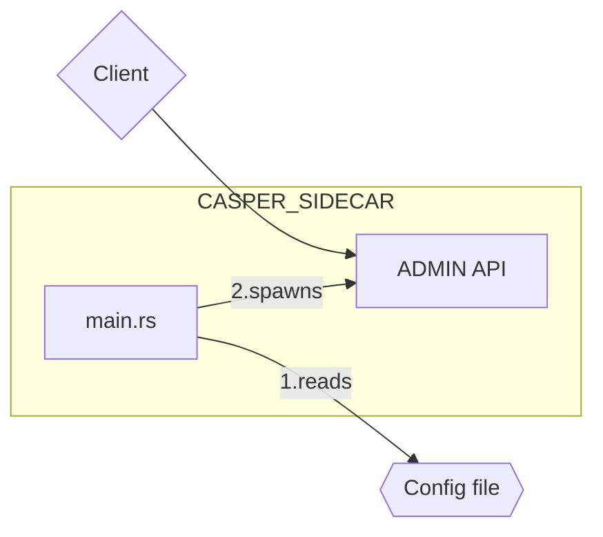
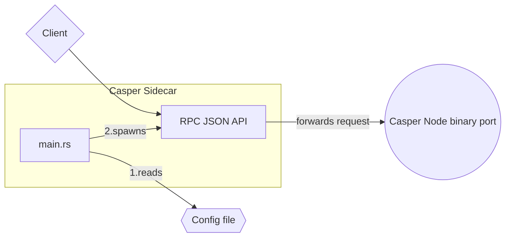

[](https://casper.network/)

[](https://github.com/CasperLabs/casper-node/blob/master/LICENSE)

# The Casper Sidecar

- [Summary of Purpose](#summary-of-purpose)
- [System Components and Architecture](#system-components-and-architecture)
  - [The SSE server](#the-sse-server)
  - [The REST API server](#the-rest-api-server)
  - [The Admin API server](#the-admin-api-server)
  - [The RPC API server](#the-rpc-api-server)
- [Configuring the Sidecar](#configuring-the-sidecar)
  - [RPC server setup](#rpc-server-setup)
  - [SSE server setup](#sse-server-setup)
    - [Configuring SSE node connections](#configuring-sse-node-connections)
    - [Configuring SSE legacy emulations](#configuring-sse-legacy-emulations)
    - [Configuring the event stream](#configuring-the-event-stream)
  - [REST server setup](#rest-server-setup)
  - [Storage setup](#setup-storage)
  - [Database connectivity setup](#database-connectivity-setup)
    - [SQLite database](#sqlite-database)
    - [PostgreSQL database](#postgresql-database)
  - [Admin server setup](#admin-server-setup)
- [Running and Testing the Sidecar](#running-and-testing-the-sidecar)
  - [Prerequisites](#prerequisites)
  - [Running the Sidecar](#running-the-sidecar)
  - [Testing the Sidecar](#testing-the-sidecar)
- [Swagger Documentation](#swagger-documentation)
- [OpenAPI Specification](#openapi-specification)
- [Troubleshooting Tips](#troubleshooting-tips)
  - [Checking liveness](#checking-liveness)
  - [Checking the node connection](#checking-the-node-connection)
  - [Diagnosing errors](#diagnosing-errors)
  - [Monitoring memory consumption](#monitoring-memory-consumption)
  - [Ensuring sufficient storage](#ensuring-sufficient-storage)
  - [Inspecting the REST API](#inspecting-the-rest-api)
  - [Limiting concurrent requests](#limiting-concurrent-requests)

## Summary of Purpose

The Casper Sidecar is an application running in tandem with the node process. It allows subscribers to monitor a node's event stream, query stored events, and query the node's JSON RPC API, thus receiving faster responses and reducing the load placed on the node. Its primary purpose is to:

- Offload the node from broadcasting SSE events to multiple clients.
- Provide client features that aren't part of the nodes' functionality, nor should they be.

While the primary use case for the Sidecar application is running alongside the node on the same machine, it can be run remotely if necessary.

## System Components and Architecture

The Casper Sidecar provides the following functionalities:

- A server-sent events (SSE) server with an `/events` endpoint that streams all the events received from all connected nodes. The Sidecar also stores these events.
- A REST API server that allows clients to query stored events.
- A JSON RPC bridge between end users and a Casper node's binary port.
- Legacy emulation for clients using older versions of the SSE API.

The Sidecar has the following components and external dependencies:



### The SSE server

The SSE Server has these components:



The SSE Listener processes events in this order:

1. Fetch an event from the node's SSE port.
2. Store the event.
3. Publish the event to the SSE API.

Casper nodes offer an event stream API that returns server-sent events (SSEs) with JSON-encoded data. The Sidecar reads the event stream of all connected nodes, acting as a passthrough and replicating the SSE interface of the connected nodes.

The Sidecar can:

- Republish the current events from the node to clients listening to Sidecar's SSE API.
- Publish a configurable number of previous events to clients connecting to the Sidecar's SSE API with `?start_from=` query (similar to the node's SSE API).
- Store the events in external storage for clients to query them via the Sidecar's REST API.

Enabling and configuring the SSE Server of the Sidecar is optional.

### The REST API server

The Sidecar offers an optional REST API that allows clients to query the events stored in external storage. You can discover the specific endpoints of the REST API using [OpenAPI](#openapi-specification) and [Swagger](#swagger-documentation). The [usage instructions](USAGE.md) provide more details.



### The Admin API server

The Sidecar offers an administrative API to allow an operator to check its current status. The Sidecar operator has the option to enable and configure this API. Please see the [admin server configuration](#admin-server) for details.



### The RPC API server

The Sidecar also offers an RPC JSON API server that can be enabled and configured so that clients can interact with a Casper network. It is a JSON bridge between end users and a Casper node's binary port. The RPC API server forwards requests to the Casper node's binary port. For more details on how the RPC JSON API works, see the [RPC Sidecar README](rpc_sidecar/README.md).



## Configuring the Sidecar

The Sidecar service must be configured using a `.toml` file specified at runtime.

This repository contains several sample configuration files that can be used as examples and adjusted according to your scenario:

- [EXAMPLE_NCTL_CONFIG.toml](./resources/example_configs/EXAMPLE_NCTL_CONFIG.toml) - Configuration for connecting to nodes on a local NCTL network. This configuration is used in the unit and integration tests found in this repository.
- [EXAMPLE_NCTL_POSTGRES_CONFIG.toml](./resources/example_configs/EXAMPLE_NCTL_POSTGRES_CONFIG.toml) - Configuration for using the PostgreSQL database and nodes on a local NCTL network.
- [EXAMPLE_NODE_CONFIG.toml](./resources/example_configs/EXAMPLE_NODE_CONFIG.toml) - Configuration for connecting to live nodes on a Casper network.

Once you create the configuration file and are ready to run the Sidecar service, you must provide the configuration as an argument using the `-- --path-to-config` option as described [here](#running-the-sidecar).

### RPC server setup

Here is an example configuration for the RPC API server:

```toml
[rpc_server.main_server]
enable_server = true
address = '0.0.0.0:7777'
qps_limit = 100
max_body_bytes = 2_621_440
cors_origin = ''

[rpc_server.node_client]
address = '0.0.0.0:28101'
max_message_size_bytes = 4_194_304
request_limit = 3
request_buffer_size = 16
message_timeout_secs = 10
client_access_timeout_secs = 10

[rpc_server.speculative_exec_server]
enable_server = true
address = '0.0.0.0:7778'
qps_limit = 1
max_body_bytes = 2_621_440
cors_origin = ''


[rpc_server.node_client.exponential_backoff]
initial_delay_ms = 1000
max_delay_ms = 32_000
coefficient = 2
max_attempts = 30
```

- `main_server.enable_server` - The RPC API server will be enabled if set to true.
- `main_server.address` - Address under which the main RPC API server will be available.
- `main_server.qps_limit` - The maximum number of requests per second.
- `main_server.max_body_bytes` - Maximum body size of request to API in bytes.
- `main_server.cors_origin` - Configures the CORS origin.

- `speculative_exec_server.enable_server` - If set to true, the speculative RPC API server will be enabled.
- `speculative_exec_server.address` - Address under which the speculative RPC API server will be available.
- `speculative_exec_server.qps_limit` - The maximum number of requests per second.
- `speculative_exec_server.max_body_bytes` - Maximum body size of request to API in bytes.
- `speculative_exec_server.cors_origin` - Configures the CORS origin.

- `node_client.address` - Address of the Casper Node binary port.
- `node_client.max_message_size_bytes` - Maximum binary port message size in bytes.
- `node_client.request_limit` - Maximum number of in-flight requests.
- `node_client.request_buffer_size` - Number of node requests that can be buffered.
- `node_client.message_timeout_secs` - Timeout for the message.
- `node_client.client_access_timeout_secs` - Timeout for the client connection.

- `node_client.exponential_backoff.initial_delay_ms` - Timeout after the first broken connection (backoff) in milliseconds.
- `node_client.exponential_backoff.max_delay_ms` - Maximum timeout after a broken connection in milliseconds.
- `node_client.exponential_backoff.coefficient` - Coefficient for the exponential backoff. The next timeout is calculated as min(`current_timeout * coefficient`, `max_delay_ms`).
- `node_client.exponential_backoff.max_attempts` - Maximum number of times to try to reconnect to the binary port of the node.

### SSE server setup

The Sidecar SSE server is used to connect to Casper nodes, listen to events from them, store them locally and re-broadcast them to clients. Here is a sample configuration for the SSE server:

```toml
[sse_server]
enable_server = true
emulate_legacy_sse_apis = ["V1"]
disable_event_persistence = false

[[sse_server.connections]]
 <Described later in the document>

[sse_server.event_stream_server]
 <Described later in the document>
```

- `sse_server.enable_server` - If set to true, the SSE server will be enabled.
- `sse_server.emulate_legacy_sse_apis` - A list of legacy Casper node SSE APIs to emulate. The Sidecar will expose SSE endpoints that are compatible with specified versions. Please bear in mind that this feature is an emulation and should be used only for transition periods. In most scenarios, having a 1-to-1 mapping of new messages into old formats is impossible, so this can be a process that loses some data and/or doesn't emit all messages that come from the Casper node. See the [Legacy SSE Emulation](./LEGACY_SSE_EMULATION.md) page for more details.
- `sse_server.disable_event_persistence` - If set to true, SSE server will not send events to storage. This is useful if you want to use sidecar only as a pass-through for sse events. The property is optional, if not defined it will behave as false.

#### Configuring SSE node connections

The Sidecar's SSE component can connect to Casper nodes' SSE endpoints with versions greater or equal to `2.0.0`.

The `node_connections` option configures the node (or multiple nodes) to which the Sidecar will connect and the parameters under which it will operate with that node. Connecting to multiple nodes requires multiple `[[sse_server.connections]]` sections.

```toml
[sse_server]
enable_server = true
disable_event_persistence = false

[[sse_server.connections]]
ip_address = "127.0.0.1"
sse_port = 18101
rest_port = 14101
max_attempts = 10
delay_between_retries_in_seconds = 5
allow_partial_connection = false
enable_logging = true
connection_timeout_in_seconds = 3
no_message_timeout_in_seconds = 60
sleep_between_keep_alive_checks_in_seconds = 30

[[sse_server.connections]]
ip_address = "127.0.0.1"
sse_port = 18102
rest_port = 14102
max_attempts = 10
delay_between_retries_in_seconds = 5
allow_partial_connection = false
enable_logging = false
connection_timeout_in_seconds = 3
no_message_timeout_in_seconds = 60
sleep_between_keep_alive_checks_in_seconds = 30

[[sse_server.connections]]
ip_address = "127.0.0.1"
sse_port = 18103
rest_port = 14103
max_attempts = 10
delay_between_retries_in_seconds = 5
allow_partial_connection = false
enable_logging = false
connection_timeout_in_seconds = 3
no_message_timeout_in_seconds = 60
sleep_between_keep_alive_checks_in_seconds = 30
```

- `ip_address` - The IP address of the node to monitor.
- `sse_port` - The node's event stream (SSE) port. This [example configuration](./resources/example_configs/EXAMPLE_NODE_CONFIG.toml) uses port `9999`.
- `rest_port` - The node's REST endpoint for status and metrics. This [example configuration](./resources/example_configs/EXAMPLE_NODE_CONFIG.toml) uses port `8888`.
- `max_attempts` - The maximum number of attempts the Sidecar will make to connect to the node. If set to `0`, the Sidecar will not attempt to connect.
- `delay_between_retries_in_seconds` - The delay between attempts to connect to the node.
- `allow_partial_connection` - Determining whether the Sidecar will allow a partial connection to this node.
- `enable_logging` - This enables the logging of events from the node in question.
- `connection_timeout_in_seconds` - Number of seconds before the connection request times out. This parameter is optional, and defaults to 5.
- `no_message_timeout_in_seconds` - Number of seconds after which the connection will be restarted if no bytes were received. This parameter is optional, and defaults to 120.
- `sleep_between_keep_alive_checks_in_seconds` - Optional parameter specifying the time intervals (in seconds) for checking if the connection is still alive. Defaults to 60.

#### Configuring SSE legacy emulations

Applications using version 1 of a Casper node's event stream server can still function using an emulated V1 SSE API for a limited time. Enabling the V1 SSE API emulation requires the `emulate_legacy_sse_apis` setting to be `["V1"]`:

```toml
[sse_server]
enable_server = true
emulate_legacy_sse_apis = ["V1"]
disable_event_persistence = false
```

This setting will expose three legacy SSE endpoints with the following events streamed on each endpoint:

- `/events/sigs` - Finality Signature events
- `/events/deploys` - DeployAccepted events
- `/events/main` - All other legacy events, including BlockAdded, DeployProcessed, DeployExpired, Fault, Step, and Shutdown events

See the [Legacy SSE Emulation](./LEGACY_SSE_EMULATION.md) page for more details.

#### Configuring the event stream

To configure the Sidecar's event stream server, specify the following settings:

```toml
[sse_server.event_stream_server]
port = 19999
max_concurrent_subscribers = 100
event_stream_buffer_length = 5000
```

- `event_stream_server.port` - The port under which the Sidecar's SSE server publishes events.
- `event_stream_server.max_concurrent_subscribers` - The maximum number of subscribers that can monitor the Sidecar's event stream.
- `event_stream_server.event_stream_buffer_length` - The number of events that the stream will hold in its buffer for reference when a subscriber reconnects.

### REST server setup

The following section determines outbound connection criteria for the Sidecar's REST server.

```toml
[rest_api_server]
enable_server = true
port = 18888
max_concurrent_requests = 50
max_requests_per_second = 50
request_timeout_in_seconds = 10
```

- `enable_server` - If set to true, the RPC API server will be enabled.
- `port` - The port for accessing the Sidecar's REST server. `18888` is the default, but operators are free to choose their own port as needed.
- `max_concurrent_requests` - The maximum total number of simultaneous requests that can be made to the REST server.
- `max_requests_per_second` - The maximum total number of requests that can be made per second.
- `request_timeout_in_seconds` - The total time before a request times out.

### Storage setup

This directory stores the SSE cache and an SQLite database if the Sidecar was configured to use SQLite.

```toml
[storage]
storage_folder = "./target/storage"
```

### Database connectivity setup

The Sidecar can connect to different types of databases. The current options are `SQLite` or `PostgreSQL`. The following sections show how to configure the database connection. Note that the Sidecar can only connect to one database at a time.

#### SQLite database

This section includes configurations for the SQLite database.

```toml
[storage.sqlite_config]
file_name = "sqlite_database.db3"
max_connections_in_pool = 100
wal_autocheckpointing_interval = 1000
```

- `storage.sqlite_config.file_name` - The database file name. The base folder where this file will be stored comes from `storage.storage_folder`.
- `storage.sqlite_config.max_connections_in_pool` - The maximum number of connections to the database (should generally be left as is).
- `storage.sqlite_config.wal_autocheckpointing_interval` - This controls how often the system commits pages to the database. The value determines the maximum number of pages before forcing a commit. More information can be found [here](https://www.sqlite.org/compile.html#default_wal_autocheckpoint).

#### PostgreSQL database

The properties listed below are elements of the PostgreSQL database connection that can be configured for the Sidecar.

- `storage.postgresql_config.database_name` - Name of the database.
- `storage.postgresql_config.host` - URL to PostgreSQL instance.
- `storage.postgresql_config.database_username` - Username.
- `storage.postgresql_config.database_password` - Database password.
- `storage.postgresql_config.max_connections_in_pool` - The maximum number of connections to the database.
- `storage.postgresql_config.port` - The port for the database connection.

To run the Sidecar with PostgreSQL, you can set the following database environment variables to control how the Sidecar connects to the database. This is the suggested method to set the connection information for the PostgreSQL database.

```
SIDECAR_POSTGRES_USERNAME="your username"
```

```
SIDECAR_POSTGRES_PASSWORD="your password"
```

```
SIDECAR_POSTGRES_DATABASE_NAME="your database name"
```

```
SIDECAR_POSTGRES_HOST="your host"
```

```
SIDECAR_POSTGRES_MAX_CONNECTIONS="max connections"
```

```
SIDECAR_POSTGRES_PORT="port"
```

However, DB connectivity can also be configured using the Sidecar configuration file. If the DB environment variables and the Sidecar's configuration file have the same variable set, the DB environment variables will take precedence.

It is possible to completely omit the PostgreSQL configuration from the Sidecar's configuration file. In this case, the Sidecar will attempt to connect to the PostgreSQL using the database environment variables or use some default values for non-critical variables.

```toml
[storage.postgresql_config]
database_name = "event_sidecar"
host = "localhost"
database_password = "p@$$w0rd"
database_username = "postgres"
max_connections_in_pool = 30
```

### Admin server setup

This optional section configures the Sidecar's administrative server. If this section is not specified, the Sidecar will not start an admin server.

```toml
[admin_api_server]
enable_server = true
port = 18887
max_concurrent_requests = 1
max_requests_per_second = 1
```

- `enable_server` - If set to true, the RPC API server will be enabled.
- `port` - The port for accessing the Sidecar's admin server.
- `max_concurrent_requests` - The maximum total number of simultaneous requests that can be sent to the admin server.
- `max_requests_per_second` - The maximum total number of requests that can be sent per second to the admin server.

Access the admin server at `http://localhost:18887/metrics/`.

## Running and Testing the Sidecar

### Prerequisites

To compile, test, and run the Sidecar, install the following software first:

- CMake 3.1.4 or greater
- [Rust](https://www.rust-lang.org/tools/install)
- pkg-config
- gcc
- g++

### Running the Sidecar

After creating the configuration file, run the Sidecar using `cargo` and point to the configuration file using the `--path-to-config` option, as shown below. The command needs to run with `root` privileges.

```sh
sudo cargo run -- --path-to-config ./resources/example_configs/EXAMPLE_NODE_CONFIG.toml
```

The Sidecar application leverages tracing, which can be controlled by setting the `RUST_LOG` environment variable.

The following command will run the Sidecar application with the `INFO` log level.

```sh
RUST_LOG=info cargo run -p casper-sidecar -- --path-to-config ./resources/example_configs/EXAMPLE_NCTL_CONFIG.toml
```

The log levels, listed in order of increasing verbosity, are:

- `ERROR`
- `WARN`
- `INFO`
- `DEBUG`
- `TRACE`

Further details about log levels can be found [here](https://docs.rs/env_logger/0.9.1/env_logger/#enabling-logging).

### Testing the Sidecar

You can run the unit and integration tests included in this repository with the following command:

```sh
cargo test
```

You can also run the performance tests using this command:

```sh
cargo test -- --include-ignored
```

The [EXAMPLE_NCTL_CONFIG.toml](./resources/example_configs/EXAMPLE_NCTL_CONFIG.toml) file contains the configurations used for these tests.

#### Testing the Sidecar using NCTL

The Sidecar application can be tested against live Casper nodes or a local [NCTL network](https://docs.casperlabs.io/dapp-dev-guide/building-dapps/setup-nctl/).

The configuration shown [here](./resources/example_configs/EXAMPLE_NCTL_CONFIG.toml) will direct the Sidecar application to a locally hosted NCTL network if one is running. The Sidecar should function the same way it would while connected to a live node, displaying events as they occur in the local NCTL network.

## Swagger Documentation

Once the Sidecar is running, access the Swagger documentation at `http://localhost:18888/swagger-ui/`. You need to replace `localhost` with the IP address of the machine running the Sidecar application if you are running the Sidecar remotely. The Swagger documentation will allow you to test the REST API.

## OpenAPI Specification

An OpenAPI schema is available at `http://localhost:18888/api-doc.json/`. You need to replace `localhost` with the IP address of the machine running the Sidecar application if you are running the Sidecar remotely.

## Troubleshooting Tips

This section covers helpful tips when troubleshooting the Sidecar service. Replace the URL and ports provided in the examples as appropriate.

### Checking liveness

To check whether the Sidecar is running, run the following `curl` command, which returns the newest stored block.

```sh
curl http://SIDECAR_URL:SIDECAR_REST_PORT/block
```

Each block should have a `.block.header.timestamp` field. Even if there were no deploys, a block should be produced every 30-60 seconds. If the latest block falls behind, it means there is an issue with the Sidecar reading events from the node. Here is a helpful script provided `jq` is installed:

```sh
curl http://SIDECAR_URL:SIDECAR_REST_PORT/block | jq '.block.header.timestamp'
```

### Checking the node connection

Checking the node connection status requires the admin server to be enabled, as shown [here](#admin-server). Use this `curl` command and observe the output:

```sh
curl http://SIDECAR_URL:SIDECAR_ADMIN_PORT/metrics
```

**Sample output**:

```sh
# HELP node_statuses Current status of node to which the Sidecar is connected. Numbers mean: 0 - preparing; 1 - connecting; 2 - connected; 3 - reconnecting; -1 - connections_exhausted -> used up all connection attempts ; -2 - incompatible -> node is in an incompatible version
# TYPE node_statuses gauge
node_statuses{node="35.180.42.211:9999"} 2
node_statuses{node="69.197.42.27:9999"} 2
```

In the above `node_statuses`, you can see which nodes are connecting, which are already connected, which are disconnected due to no more retries, etc. The number next to each node represents the connection status:

- `0` - The Sidecar is preparing to connect
- `1` - The Sidecar is connecting to the node
- `2` - The Sidecar is connected to this node
- `3` - The Sidecar is reconnecting
- `-1` - The Sidecar is not connected and has reached the maximum connection attempts
- `-2` - The Sidecar is not connected due to an incompatible node version

### Diagnosing errors

To diagnose errors, look for `error` logs and check the `error_counts` on the metrics page, `http://SIDECAR_URL:SIDECAR_ADMIN_PORT/metrics`, where most of the errors related to data flow will be stored:

```sh
# HELP error_counts Error counts
# TYPE error_counts counter
error_counts{category="connection_manager",description="fetching_from_stream_failed"} 6
```

### Monitoring memory consumption

To monitor the Sidecar's memory consumption, observe the metrics page, `http://SIDECAR_URL:SIDECAR_ADMIN_PORT/metrics`. Search for `process_resident_memory_bytes`:

```sh
# HELP process_resident_memory_bytes Resident memory size in bytes.
# TYPE process_resident_memory_bytes gauge
process_resident_memory_bytes 292110336
```

If memory consumption is high without an apparent reason, please inform the Sidecar team by creating an [issue in GitHub](https://github.com/casper-network/casper-sidecar/issues).

Remember to check the `event_stream_buffer_length` setting in the configuration because it dramatically impacts how much memory the Sidecar consumes. Also, some events, like step events, consume more memory.

### Ensuring sufficient storage

Ensuring enough space in the database is essential for the Sidecar to consume events produced from the nodes' SSE streams over a more extended period. Each event is written to the database in a raw format for future processing. Running the Sidecar for an extended period (weeks or months) can result in storing multiple Gigabytes of data. If the database runs out of space, the Sidecar will lose events, as it cannot record them.

### Inspecting the REST API

The easiest way to inspect the Sidecar’s REST API is with [Swagger](#swagger-documentation).

### Limiting concurrent requests

The Sidecar can be configured to limit concurrent requests (`max_concurrent_requests`) and requests per second (`max_requests_per_second`) for the REST and admin servers.

However, remember that those are application-level guards, meaning that the operating system already accepted the connection, which used up the operating system's resources. Limiting potential DDoS attacks requires consideration before the requests are directed to the Sidecar application.

## License

Licensed under the [Apache License Version 2.0](https://github.com/casper-network/casper-node/blob/master/LICENSE).
